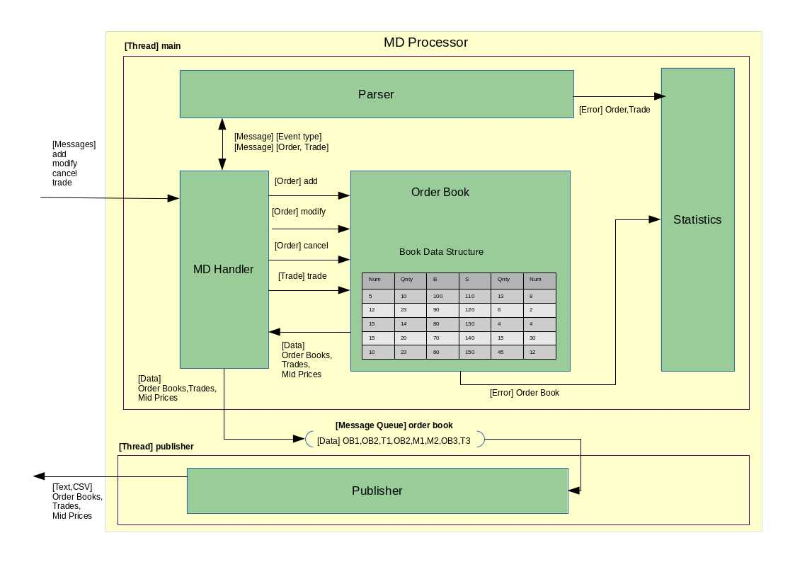

MD Processor
------------

## Installation

You can install md_processor (if you have not already done so for md_simulation) from `github` using the 

```{bash}
cd <a repository directory>
git clone https://github.com/cdtait/simulation.git
```

The c++ code is based on c++11 and was developed with g++ 4.8.2 and stl only. 

However src directory has is all the c++ files required for the project, the main file is in md.cpp. Four further sub directories are included. These too are open source inlcudes to suport the md processor. 

* The disruptor is a c++ version of the LMAX disruptor. 
* The vectorclass directory contains VCL which implements vectorization libraries for vector and matrix arithmetic on SSE2 and AVX supported platforms. 
* The strtk dirctory has some useful templates to support parsing string streams into numbers and avoids boost lexical_cast, stringstream and atoi/f calls in favour of more optimal type creation.
* The json_spirit implements the json parser we use for the input straem

```{bash}
cd  simulation/md_processor
```

This is actually a eclipse project so it can be imported in eclipse if desired. At this level there a Debug,Release and src directories. To compile a release version and to make a release build. Change directory into Release and type 

```{bash}
$ cd Release
$ make clean
rm -rf  ./src/md.o  ./src/md.d  md_processor

$ make
Building file: ../src/md.cpp
Invoking: GCC C++ Compiler
g++ -I"/home/obod/git/simulation/md_processor/src" -I"/home/obod/git/simulation/md_processor/src/vectorclass" -O3 -Wall -c -fmessage-length=0 -std=c++11 -fabi-version=4 -MMD -MP -MF"src/md.d" -MT"src/md.d" -o "src/md.o" "../src/md.cpp"
Finished building: ../src/md.cpp
 
Building target: md_processor
Invoking: GCC C++ Linker
g++  -o "md_processor"  ./src/md.o   -lpthread
Finished building target: md_process
```
It should only take a few seconds.

As an option there is a sample of data which can be used with the ipython notebook md_example.ipynb however the data director samples are compressed

```{bash}
gunzip data/*.gz
```
Now run the notebook

```{bash}
$ ipython notebook
```
Now select md_example.ipynb from <a repository directory>/simulation/md_processor

The following is an example run of the md_processor.

```{bash}
$ Release/md_processor -p C -d M -f data/md-test-2.json 2> data/md-test.C-M.stats > data/md-test-2.C-M.csv
```

This would produce the md-test-2.C-M.csv which can be used later for analysis. The md-test.C-M.stats are a record of
errors that if the source data/md-test-2.json was produced with deliberate or otherwise invalid data these would be 
recorded in the stats.

* The -p option takes T or C meaning that we want to print in csv(C) format or readable text(T). 
* The -d takes M H or V which are the internal data structure which we are assessing to see which performs the best. 
 * M is a std::map based order book
 * H is a std::unordered_map
 * V is std::vector base map

## Features

The Processor design is aimed at handling data produced by the md_simulator or real world market data producers like betfair or other trading platforms. Processing this data enables different simulation strategies from different sources such as betting or trading to create output with trade and pricing book structure in a form that can be loaded into analysis tools.

The processor is resonsible for -

1. Parsing the json events and trap any corruption error type scenarios.
2. Create event objects which can be presented to the order book
3. Order book implement the methods that respond to add, modify, cancel and trade
4. Back the order book which a storage data structure which will allow prices at levels to be maintained and orders to be held at each price. Levels are Buy(Bid) or Sell(Ask).
5. The order book needs to present itself in a readable form so implement some sort of output stream/print function
6. The handler then is created to make use of the event objects and direct the methods to call on the order book object. The interface look and feel tries to keep in line with the stub code given in specification.
7. Processor provides a methods to print the error summary from the processing of the feed and this in turn implies we need some sort of globally available statistics recording object as both the order book and parsing parts of the flow.


<figure role="group">

<figcaption>Fig 1. MDProcessor</figcaption>
</figure>

---

### Credits
- [disruptor](https://github.com/fsaintjacques/disruptor--) by François Saint-Jacques
- [json_spirit](http://www.codeproject.com/Articles/20027/JSON-Spirit-A-C-JSON-Parser-Generator-Implemented) by John W. Wilkinson
- [strtk](http://www.partow.net/programming/strtk/index.html) by Arash Partow
- [vcl](www.agner.org/optimize) by Agner Fog

### License

md_processor is licensed under the GPLv2 License. 


