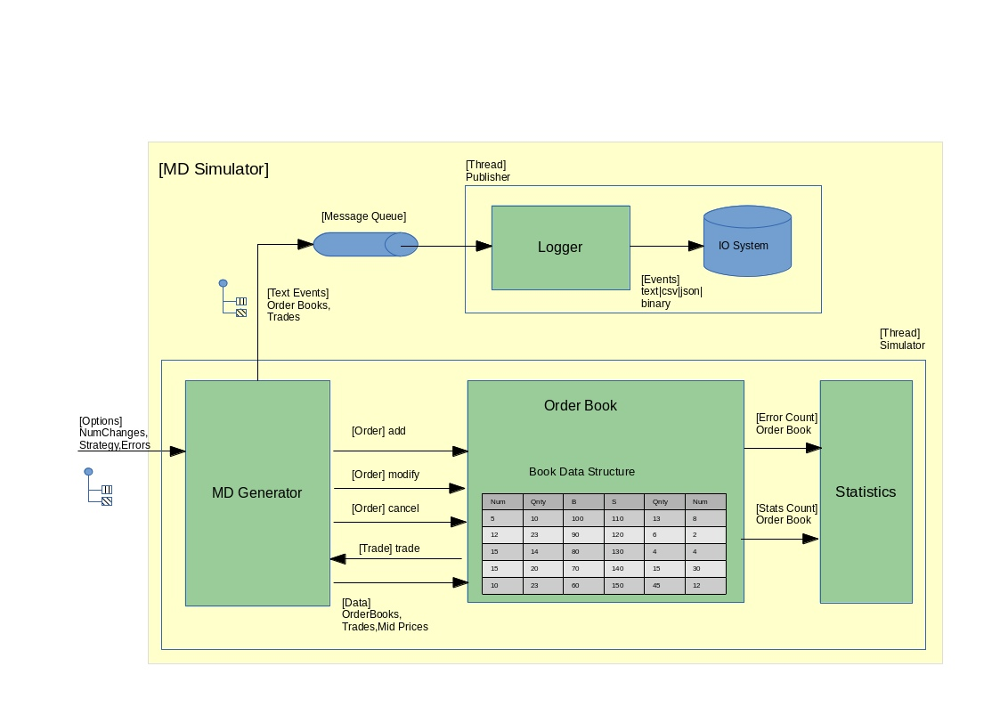
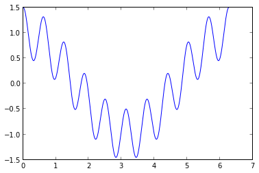
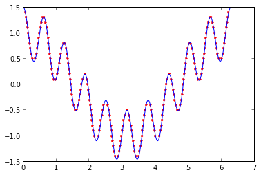
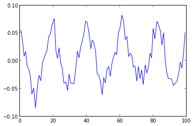
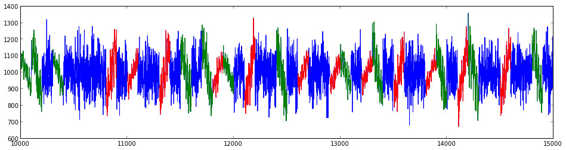

# Market Data Generator

This is data generation toolto produce simulation market data 

## Overview

This part simulation frame work is designed to exhibit pricing behaviour based on strategies that combine to make up the behaviour of the book

The design contains of a (MDGenerator) market data generator which takes a set of options to create the simulated data. Data can be generated with/without error events (test integrity, exception handling) and with different strategies. The (OrderBook) is used to maintain the coherence of the book and produce the trades and offsetting orders that are needed to create a correct set of events that will drive order book and price change simulations. The (Logger) is a background consumer which writes the events into disk. Also there are (Statistics) gathered which should match any checking for errors and the general numbers of events produced.

<figure role="group">

<figcaption>Fig 1. Overview</figcaption>
</figure>

## Installation

You can install md_simulator (if you have not already done so for md_processor) from `github` using the 

```{bash}
cd <a repository directory>
git clone https://github.com/cdtait/simulation.git
```

The generator is enitirely written in standard python and comes in the form of an eclipse PyDev project.

## Data generation

The feed_handler is tested against as realistic order book behaviour as required. This is done from the generation.py code which can create as many events as needed and can also supply randomised error. In the directory there are 4 files

* md.csv This is the default test event file it contains no errors and produces order books(add,amend,cancel) and trades• md.stat This is the default stat file for the md.csv it has the summary of error statistics which in the md.csv all error counts are zero
* md.with.err.csv This is the default event file include errors and contains a small but significant nimber of errors and will produce caught exceptions in the feed handler
* md.with.err.stat This is the statistics of the error event file and when the feed handler runs against the md.with.err.csv should produce exactly the same error count as there is here.

```{python}
cd simulation/md_simulator
python src/generator.py -h
Usage: generator.py [options]

Options:
  -h, --help            show this help message and exit
  -c CHANGES, --num_changes=CHANGES
  -e, --errors          
  -s STRATEGY, --strategy=STRATEGY
```

Run the generator with a target 100000 events no errors

```{python}
python src/generator.py --num_changes 100000 --strategy RandomStrategy 2> md.stat > md.csv
```

Run the generator with a target 100000 events with errors

```
python src/generator.py --errors --num_changes 100000 --strategy RandomStrategy 2> md.with.err.stat > md.with.err.csv
```
## Ipython notebook

As an option there is a sample of data which can be used with the ipython notebook SimulatingPriceRecognition.ipynb

```{bash}
$ ipython notebook
```
Now select SimulatingPriceRecognition.ipynb from <a repository directory>/simulation/md_simulator

# Simulating and recognising price patterns

This experiment is to explore the basis of simulating price
movement that could be recognised analytically. Prices move in betting and
trading systems and often are due to economic pressures and events from
participants in the market. So as a starting point we can see if it is feasible
to produce price movement shapes that can be recognised in amongst the chaotic
background noise. The ultimate goal is to use this as a basis to create new stratgeies in the generator which we can create behaviours that can be recognised.

```{python}
    %pylab inline
    
    import pylab as pl
    import numpy as np
    
    np.set_printoptions(threshold=numpy.nan,precision=5)

    
    Welcome to pylab, a matplotlib-based Python environment [backend: module://IPython.zmq.pylab.backend_inline].
    For more information, type 'help(pylab)'.
```

Take a very simple sum of 2 sine waves as a price movement curve.


    N = 10000
    X = np.linspace(0, 2*np.pi, N)[:, np.newaxis]
    y = (np.cos(X).ravel()+ 0.5*np.cos(10 * X).ravel())

We can see that the function has characteristics that may allow us to build
patterns from parts or all of the range.


    plt.figure(figsize=(6, 4))
    plt.plot(X.ravel(), y, color='blue')


    [<matplotlib.lines.Line2D at 0x36ce890>]





To convert this to descrete intervals on the y axis, intervals that can mimic
the change in say a price i.e 1000 to 1010 as 1 tick of 10 then we need to remap
the values from y to x and produce a set of points that can serve as a pattern
template to make other patterns. In order to find the y points at the intervals
in the y axis which are effectively the roots of the template function crossing
at the y interval line.


    from scipy.optimize import fsolve
    from collections import OrderedDict
    
    def f(xy,yi):
        '''
        Function to match the crossing point with this particular function
        as z closes in on 0.
        '''
        x, y = xy
        z = np.array([y-yi,y-(np.cos(x)+ 0.5*np.cos(10 * x))])
        return z
    
    def get_x_root(xs,ys,f,root):
        '''
        Get a root starting from xs,ys
        '''
        x,y=fsolve(f, [xs,ys],root)
        return round(x,5),round(y,5)
    
    ypoints=np.array([])
    xpoints=np.array([])
    
    # Going up and down the y axis that descrete interval points
    # that we will use to travels acros the x plane and find all the crossing
    # points on the interval plane
    for ys in np.arange(-1.5, 1.5, 0.1):
        d=[]
        xs=0.
        # Go across the entrie range in x for the plane ys
        while xs <= 2*pi:
            xr,yr=fsolve(f,[xs,ys],ys)
            c=round(np.cos(xr)+ 0.5*np.cos(10 * xr),2)
            if round(ys,2)==round(yr,2) and xr>0. and xr<=2*pi and c==round(ys,2):
                d.append(round(xr,5))
            xs+=0.01
        xroots=list(OrderedDict.fromkeys(d))
        yline=np.empty(len(xroots))
        yline.fill(round(ys,2))
        ypoints=append(ypoints,yline)
        xpoints=append(xpoints,xroots)

On completing the pass and finding the roots on each plane we don't nesccersial
have them in x axis acending order so to we sort by the points in the xaxis.


    xpoints_sorted_index=np.argsort(xpoints)
    xpoints=xpoints[xpoints_sorted_index]
    ypoints=ypoints[xpoints_sorted_index]

To make is clearer what we have found here we can show the points plotted
against the true curve.


    plt.figure(figsize=(6, 4))
    plt.plot(xpoints, ypoints, '.k', color='red')
    plt.plot(X.ravel(), y, color='blue')


    [<matplotlib.lines.Line2D at 0x36e3c50>]





As a probe into using this curve as a template and break into into 2 patterns
which we will use in the simulation and try to recognise when the patterns
appear in a cluster of other patterns and stocastic noise.


    ysect1=ypoints[xpoints<np.pi]
    xsect1=xpoints[xpoints<np.pi]
    ysect2=ypoints[xpoints>=np.pi]
    xsect2=xpoints[xpoints>=np.pi]

Its useful to develop some functions that can help create pattern images that
can be interspersed in other patterns.


    import time
    
    # Use time cycle to produce a more random seed
    time_cycle = lambda t: int(1e6*(t - numpy.fix(t)))
    
    # Base RNG with unchanging seed
    rng = np.random.RandomState(time_cycle(time.time()))
        
    def get_noise(xpattern,ypattern,numPoints,lastPoint=0,error=0.6,
                  rng=np.random.RandomState(time_cycle(time.time()))):
        '''
        Create a peice of random noise 
        '''
        Yerror=rng.normal(0, error, numPoints)
        Xerror=np.arange(lastPoint,lastPoint+Yerror.shape[0],1)
    
        return(Xerror,Yerror)
    
    def get_pattern(xpattern,ypattern,numPoints,lastPoint=0,error=0.4,
                    rng=np.random.RandomState(time_cycle(time.time()))):
        '''
        Create a piece of a pattern and add noise
        '''
        Xp=((xpattern*xpattern.shape[0]/np.pi).round()+lastPoint)[:numPoints]
        Yerror=rng.normal(0, error, Xp.shape[0])
        Yp=(ypattern[:Xp.shape[0]]+Yerror)
        
        return(Xp,Yp)


Create a way generating a set of test sample patterns which we can shuffle to
gether to produce an noisy set of patterns so altogether we have 2400 patterns
some upward cycles some downward of 2 different sizes and some noise of 2
different sizes.


    
    def gen_test_samples():
        '''
        The 6 patterns we create a number each as set of data
        The target tells us what kind of pattern we produced
        '''
        target=[]
        data=[]
        for i in np.arange(0,100,1):
            (Xprices,Yprices)=get_pattern(xsect1,ysect1,100,0)
            data.append(append(Xprices,Yprices))
            target.append(0)
        
        for i in np.arange(100,200,1):
            (Xprices,Yprices)=get_pattern(xsect2,ysect2,100,0)
            data.append(append(Xprices-100,Yprices))
            target.append(1)
    
        for i in np.arange(200,300,1):
            (Xprices,Yprices)=get_pattern(xsect1,ysect1,100,0)
            data.append(append(Xprices,Yprices/2))
            target.append(0)
    
        for i in np.arange(300,400,1):
            (Xprices,Yprices)=get_pattern(xsect2,ysect2,100,0)
            data.append(append((Xprices)-100,Yprices/2))
            target.append(1)
    
        for i in np.arange(400,1600,1):
            (Xprices,Yprices)=get_noise(None,None,100,0)
            data.append(append(Xprices,Yprices))
            target.append(2)
        
        for i in np.arange(1600,2400,1):
            (Xprices,Yprices)=get_noise(None,None,100,0)
            data.append(append(Xprices,Yprices/2))
            target.append(2)
            
        target=np.array(target)
        data=np.array(data)
        
        return(target,data)
    
    (target,data)=gen_test_samples()

The test sample is geared towards being modelled as a classification problem so
we want to train and set of data and match that with a crosss validation set to
enable a classification alogrithm to make a better fit or performance.


    from sklearn.cross_validation import train_test_split
    X_train, X_test, y_train, y_test = train_test_split(data, target, random_state=0)
    
    print X_train.shape, X_test.shape

    (1800, 200) (600, 200)


Before we apply the classification we can have a look at an other technique
often used in conjunction with classification and can aid the performance of of
the classifier although in this case it is not neccesary as we effectively have
only 200 features per sample as we seen from the previous shape descriptions.


    from sklearn import decomposition
    pca = decomposition.RandomizedPCA(n_components=100, whiten=True)
    pca.fit(X_train)


    RandomizedPCA(copy=True, iterated_power=3, n_components=100,
           random_state=None, whiten=True)


So have a look at avarage pca shape of 100 features and see what it looks like.


    pca.mean_.shape
    pcax,pcay=pca.mean_.reshape(2,100)
    plt.plot(pcax,pcay,color='blue')
    pca.mean_.shape


    (200,)





Produce a test set from the pca to see the performance with reduced features
before we go onto see the test set without pca


    X_train_pca = pca.transform(X_train)
    X_test_pca = pca.transform(X_test)


    print X_train_pca.shape
    print X_test_pca.shape
    print X_train.shape
    print X_test.shape

    (1800, 100)
    (600, 100)
    (1800, 200)
    (600, 200)


Now lets take a look at the support vector machine to train and test


    from sklearn import svm
    clf = svm.SVC(C=5., gamma=0.001)
    clf.fit(X_train, y_train)


    SVC(C=5.0, cache_size=200, class_weight=None, coef0=0.0, degree=3,
      gamma=0.001, kernel='rbf', max_iter=-1, probability=False,
      random_state=None, shrinking=True, tol=0.001, verbose=False)


Produce the metrics. We can see that it has a perfect score but this not typcal
it is just that the patterns we have choosen are quite well defined. The
exercise is useful to see the process and measurement process.


    from sklearn import metrics
    y_pred = clf.predict(X_test)
    print(metrics.classification_report(y_test, y_pred))

                 precision    recall  f1-score   support
    
              0       1.00      1.00      1.00        51
              1       1.00      1.00      1.00        44
              2       1.00      1.00      1.00       505
    
    avg / total       1.00      1.00      1.00       600
    


Create a random noise pattern and see if we can identify it.


    (Xprices,Yprices)=get_noise(None,None,100,0)
    d=np.array(append(Xprices,Yprices))
    prediction=clf.predict(d)
    print("Prediction(0:rising pattern,1:falling pattern,2:noise) - {0:s} expected - 2 noise".format(prediction))

    Prediction(0:rising pattern,1:falling pattern,2:noise) - [2] expected - 2 noise


Create a randomly shuffled test set now that we can use to develope a visual the
pattern matching example.


    (target_test,data_test)=gen_test_samples()
    shuffle_index=np.arange(0,1000,1)
    np.random.shuffle(shuffle_index)
    dt=data_test[shuffle_index]


    def show_prediction_example(start,end):
        plotx=np.array([])
        ploty=np.array([])
    
        plt.figure(figsize=(16, 4))
        
        # Display whole price movement
        for i in range(start,end):
            Xprices,Yprices=dt[i].reshape(2,100)
            plotx=np.append(plotx,Xprices+(i*100))
            ploty=np.append(ploty,Yprices)
    
        plt.plot(plotx,ploty*150+1000,color='blue')
    
        correct_predictions=0
        tt=target_test[shuffle_index]
    
        # Overlay the recognised patterns
        for i in range(start,end):
            Xprices,Yprices=dt[i].reshape(2,100)
            actual_type=tt[i]
            d=np.array(append(Xprices,Yprices))
            prediction=clf.predict(d)
            if actual_type==prediction:
                correct_predictions+=1
            if prediction==0:
                plt.plot(Xprices+(i*100),Yprices*150+1000,color='green')
            elif prediction==1:
                plt.plot(Xprices+(i*100),Yprices*150+1000,color='red')
    
        return correct_predictions/(end-start)

Visually we can pickout the patterns and noise red being the up slopes, green
the down slopes and blue is noise.


    print("Prediction accuracy {0:f} %".format(show_prediction_example(100,150)*100))

    Prediction accuracy 100.000000 %





In summary this is a first step toward recognising feature spaces which can be
then applied to predict what the price will do next. If we can recognise part of
a pattern then the possiblity of knowing the rest of the shape then could
suggest we know what it may do next. A further discussion is needed to probe the
steps towards a real system accumulating data in realtime and how to use sliding
data windows to examining pattrens.


### License

md_simulator is licensed under the GPLv2 License. 


